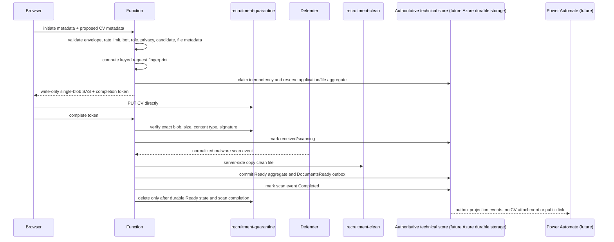

# Recruitment application backend — Phase 2A core contract

Status: Phase 2A implemented as testable domain modules only. No public form, live Azure Function, live SAS generator, SharePoint adapter, credentials, or Azure resources are included.

## Endpoint contracts

### `POST /api/recruitment/applications/initiate`
Accepts role id, locale, source, clientSubmissionId, minimal candidate fields, privacy acceptance/version, and declared CV metadata only. The API never receives CV bytes. On success it reserves application/file records and returns an application reference, file reference, one short-lived PUT upload grant, and an opaque completion token.

### `POST /api/recruitment/applications/complete`
Accepts applicationReference, fileReference, and completionToken. It verifies the token, resolves server-side records, checks the exact quarantine blob, verifies size/content type, inspects actual PDF/DOCX bytes, marks scan pending, and moves the application to Scanning. It does not run antivirus scanning.

### Event Grid scan result
The testable handler accepts normalized Defender results: Clean, Malicious, ScanFailed, Unsupported, Timeout. Clean files are promoted through `storage.promoteClean`, which may represent an asynchronous Azure server-side copy and must not be treated as complete until the adapter reports verified success. Malicious files are blocked; failed/unsupported/timeouts require manual review.



## Role eligibility
The server-bundled role manifest is authoritative. A role accepts applications only when `status` is `published`, `application.enabled` is true, `application.privacyNoticeVersion` is a non-empty approved value matching the request, `contentReviewRequired` is false, any `deadlineUtc` has not passed, and the requested locale exists. Browser-supplied role title, department, location, application status, and file rules are ignored.

## Candidate and file contract
Required fields: `fullName`, `email`, `privacyAccepted`. Optional fields: `telephone`, `currentLocation`, `linkedinUrl`, `coverNote`. System fields: `roleId`, `locale`, `source`, `clientSubmissionId`, `privacyNoticeVersion`, `submittedAtClientUtc`. Limits are 200/254/50/200/300/4000 characters respectively, original filename 255 characters, and CV size from the manifest. Email normalization trims and lowercases only the domain.

CV uploads are PDF and DOCX only. Legacy `.doc` files are rejected. Completion verifies `%PDF-` magic bytes and a minimum plausible size for PDFs. DOCX validation uses bounded ZIP parsing without filesystem extraction, rejects encrypted/malformed/traversal/unsupported-compression archives and ZIP bombs, requires `[Content_Types].xml` and `word/document.xml`, and verifies the content-types part identifies a WordprocessingML document. Malware scanning remains the security boundary; signature checks only reject obvious format mismatches before scan processing.

## Storage and SAS restrictions
Private logical containers: `recruitment-quarantine` and `recruitment-clean`. Blob paths use `recruitment/{year}/{roleId}/{applicationReference}/{fileReference}.{extension}` and never include name, email, telephone, or original filename. Original filenames are stored only as controlled RecruitmentFiles metadata.

Production upload grants must be user-delegation SAS, HTTPS-only, one exact blob, create/write only, no read/list/delete/container permissions, maximum 10 minute expiry, small clock-skew start time, and no browser secrets. Production CORS origins: `https://shorevest.com` and `https://www.shorevest.com`; GitHub Pages origin may be non-production only.

## State machines
Application states: Initiated, UploadPending, Received, Scanning, Ready, ManualReview, Blocked, Incomplete, Error. File states: SASIssued, Uploaded, ValidationFailed, ScanPending, Clean, Ready, Malicious, ScanFailed, ManualReview, Removed. Hiring stages are separate: New, UnderReview, Interview, Hold, Rejected, Offer, Hired, Withdrawn. Public APIs cannot set hiring stages.

## Authoritative technical persistence
The durable technical application state, file state, idempotency records, initiation reservations, completion claims, scan-event claims, and outbox events belong in one authoritative technical persistence layer. Phase 2B must implement this with Azure-native durable storage that supports conditional writes and transactional updates within one application aggregate. SharePoint is not the authoritative transaction store; it is the restricted HR-facing administrative projection populated from outbox/projection workers.

Future projection flow:

```text
Authoritative technical store
        ↓
Outbox / projection worker
        ↓
RecruitmentApplications SharePoint List
RecruitmentFiles SharePoint List
```

## Repository interfaces
All infrastructure-facing dependency methods are asynchronous and must be awaited, even when a test adapter can return an immediate value. This includes `loadManifest`, `rateLimiter.check`, `botVerifier.verify`, reference generation, token signing/verification, SAS issuance, application/file persistence, Blob operations, scan-event records, outbox writes, logging, and clock abstractions.

Initiation validation is completed before any durable idempotency claim is acquired: request envelope and field types, rate limit, bot verification, authoritative manifest load, role/locale/privacy/source eligibility, candidate fields, and file metadata all reject without creating or retaining an initiation claim. Only after those deterministic checks pass does the domain compute a keyed request fingerprint and call the idempotency adapter.

Initiation idempotency is durable and status-based: `idempotency.claim(key, leaseOwner, leaseExpiresAtUtc, requestFingerprint)`, `get(key)`, `recordReservation(key, reservation)`, credential-issuance lease methods, `retryableFailure(key, reason)`, `permanentFailure(key, reason)`, and `releaseExpiredClaim(key)`. Records use Claimed, SubmissionReserved, CredentialIssuing, CredentialsIssued, CredentialRetryable, RetryableFailure, and PermanentFailure states. The completed initiation record stores stable submission state separately from temporary upload credentials. Adapters must never return live JavaScript promises for another invocation. Active claims are resolved only by a short bounded poll or a controlled `SUBMISSION_IN_PROGRESS` response with retry-after metadata.

Initiation reservations persist idempotency key, role id, clientSubmissionId, generated application/file references, exact quarantine blob path, original filename, expected extension/size/MIME type, privacy notice version, keyed request fingerprint, credential generation, state, and timestamps. Retries after reservation, SAS issuance, token signing, record creation, or idempotency-completion failures reuse the same reservation and must not create duplicate applications, files, or blob paths. `reserveSubmission` must enforce durable uniqueness for the idempotency key, application reference, file reference, and quarantine blob path. If existing application/file records are found, they must match the reservation and request fingerprint across role id, idempotency key, references, blob path, expected size/MIME type, privacy version, and fingerprint; mismatches are permanent integrity conflicts and must not be overwritten.


Request fingerprints are produced from canonical validated immutable submission data: role id, locale, source, normalized candidate fields, privacy notice version, original file name, expected file size, and expected MIME type. The canonical plaintext is never stored or logged. Production adapters must use keyed HMAC or equivalent keyed hashing so candidate emails cannot be dictionary-searched from the technical store. Reusing the same role id and clientSubmissionId with materially different validated data returns `IDEMPOTENCY_CONFLICT` without revealing which field differed and without creating another application or file.

Credential issuance uses a durable conditional lease. Only a caller that transitions the initiation record to CredentialIssuing may issue the SAS URL and sign the completion token. Duplicate callers during active issuance receive `SUBMISSION_IN_PROGRESS`; expired issuance leases and retryable issuance failures can be reclaimed. Retries always reuse the same application reference, file reference, quarantine blob path, expected size, and expected MIME type. Only the committed generation is authoritative.

Upload credentials are temporary. The stable initiation result records application reference, file reference, quarantine blob path, application/file technical statuses, authoritative credential generation, and last credential expiry. While upload remains pending, a retry returns current credentials only when they are safely valid; otherwise it issues a fresh SAS and completion token for the same reservation and increments the generation. Once upload verification or scanning has begun, initiation retries do not issue new SAS URLs and return an already-submitted/status response. Ready, ManualReview, and Blocked applications likewise return stable already-submitted wording without scan internals.

Completion tokens include the credential generation. The simple Phase 2A.3 rule is that only the latest generation is accepted; superseded, expired, tampered, or cross-application tokens return `TOKEN_INVALID`. Completion claims preserve permanent failures, allow RetryableFailure and expired Processing leases to be reclaimed, return active Processing as in-progress, and return Completed results idempotently.

Aggregate writes use `applicationStore.commitAggregate({ expectedVersion, application, files, outboxEvents })`. The implementation must atomically commit application changes, related file changes, aggregate version, and outbox events, using optimistic concurrency through an aggregate version, ETag, or equivalent expected version. A stale expected version is a controlled retryable conflict; injected application, file, or outbox failures must leave no partial aggregate update.

Upload completion has its own durable lifecycle: NotStarted, Processing, Completed, RetryableFailure, and PermanentFailure. A lease or conditional transition ensures only one caller verifies a SASIssued file and only one `ApplicationReceived` event is committed. Concurrent callers receive the completed result, `SUBMISSION_IN_PROGRESS`, or a retryable controlled response; expired Processing leases can be reclaimed.

Scan-event processing uses a durable leased lifecycle with event key, event id, file reference, state, lease owner/expiry, attempt count, last error code, and created/updated/completed timestamps. Completed events deduplicate, active leases block concurrent handling, expired Processing and RetryableFailure records can be retried, and PermanentFailure records are not silently retried. Events are marked Completed only after durable state/outbox updates succeed. If aggregate and outbox commits succeeded but scan-event completion recording failed, retry reconciles the exact already-applied Clean, Malicious, or ManualReview outcome by matching event id, file reference, blob path, result, final application/file states, expected clean blob path where applicable, and the required outbox event. Matching retries mark the scan event Completed without duplicate outbox, promotion, or destructive cleanup; conflicting outcomes remain permanent integrity failures.

Clean scan ordering is promote-and-verify clean blob first, commit Ready state plus `DocumentsReady` and `quarantineRemovalPending=true` atomically, mark the scan event Completed, then delete quarantine separately. Failed deletion preserves Ready state, creates `QuarantineCleanupRequired`, and is retried by `retryQuarantineCleanup`. Malicious ordering commits Blocked/Malicious state and `MaliciousFileDetected` before any quarantine retention/deletion policy is applied.

## HR-facing SharePoint projection schemas
`RecruitmentApplications`: ApplicationReference, RoleId, RoleTitle, RoleDepartment, RoleLocation, Locale, Source, CandidateName, CandidateEmail, CandidateTelephone, CandidateLocation, LinkedInUrl, CoverNote, PrivacyNoticeVersion, PrivacyAcceptedAtUtc, SubmittedAtClientUtc, SubmittedAtServerUtc, TechnicalStatus, HiringStage, FileCount, ReadyFileCount, RequiresManualReview, RetentionReviewDate, LastUpdatedAtUtc.

`RecruitmentFiles`: FileReference, ApplicationReference, FilePurpose, OriginalFileName, DeclaredMimeType, DetectedFileType, SizeBytes, ExpectedHash, QuarantineBlobPath, CleanBlobPath, QuarantineRemovalPending, TechnicalStatus, ScanResult, ScanEventId, UploadVerifiedAtUtc, ScanStartedAtUtc, ScanCompletedAtUtc, ReadyAtUtc, QuarantineRemovedAtUtc, RetentionReviewDate, LastUpdatedAtUtc.

Both lists require restricted HR list/site permissions. Filtered SharePoint views are not access control. CVs must remain in Azure Blob Storage, not a SharePoint document library.

## Notifications
Internal outbox event names: ApplicationReceived, DocumentsReady, ManualReviewRequired, MaliciousFileDetected, QuarantineCleanupRequired. The core does not send email or call external notification delivery directly. Future Power Automate flows must not include CV attachments or public CV links.

## Error-code contract
Candidate-facing responses use generic codes: ROLE_NOT_FOUND, ROLE_NOT_OPEN, APPLICATION_DEADLINE_PASSED, VALIDATION_FAILED, PRIVACY_VERSION_INVALID, FILE_MISSING, FILE_TYPE_REJECTED, FILE_TOO_LARGE, FILE_SIGNATURE_REJECTED, RATE_LIMITED, BOT_VERIFICATION_FAILED, TOKEN_INVALID, BLOB_NOT_FOUND, BLOB_MISMATCH, DUPLICATE_EVENT, STATE_TRANSITION_INVALID, SUBMISSION_FAILED, SUBMISSION_IN_PROGRESS, IDEMPOTENCY_CONFLICT, RESERVATION_INTEGRITY_CONFLICT.

## Phase 2B environment variables
Names only: recruitment manifest bundle path, Azure Storage account/container names, managed-identity/client configuration, token-signing key reference, CORS environment, rate-limit store configuration, bot-verification provider configuration, SharePoint site/list identifiers, notification event destination, retention-policy settings, structured-log sink.

## Unresolved decisions
Final recruitment privacy notice/version, production bot provider, rate-limit thresholds, retention periods for malicious/manual-review files, SharePoint site/list provisioning, Power Automate owner and message templates, Defender Event Grid normalization details, and candidate acknowledgement wording.
