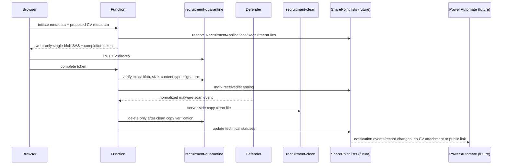

# Recruitment application backend — Phase 2A core contract

Status: Phase 2A implemented as testable domain modules only. No public form, live Azure Function, live SAS generator, SharePoint adapter, credentials, or Azure resources are included.

## Endpoint contracts

### `POST /api/recruitment/applications/initiate`
Accepts role id, locale, source, clientSubmissionId, minimal candidate fields, privacy acceptance/version, and declared CV metadata only. The API never receives CV bytes. On success it reserves application/file records and returns an application reference, file reference, one short-lived PUT upload grant, and an opaque completion token.

### `POST /api/recruitment/applications/complete`
Accepts applicationReference, fileReference, and completionToken. It verifies the token, resolves server-side records, checks the exact quarantine blob, verifies size/content type, inspects actual PDF/DOCX bytes, marks scan pending, and moves the application to Scanning. It does not run antivirus scanning.

### Event Grid scan result
The testable handler accepts normalized Defender results: Clean, Malicious, ScanFailed, Unsupported, Timeout. Clean files are promoted through `storage.promoteClean`, which may represent an asynchronous Azure server-side copy and must not be treated as complete until the adapter reports verified success. Malicious files are blocked; failed/unsupported/timeouts require manual review.

## Role eligibility
The server-bundled role manifest is authoritative. A role accepts applications only when `status` is `published`, `application.enabled` is true, `application.privacyNoticeVersion` is a non-empty approved value matching the request, `contentReviewRequired` is false, any `deadlineUtc` has not passed, and the requested locale exists. Browser-supplied role title, department, location, application status, and file rules are ignored.

## Candidate and file contract
Required fields: `fullName`, `email`, `privacyAccepted`. Optional fields: `telephone`, `currentLocation`, `linkedinUrl`, `coverNote`. System fields: `roleId`, `locale`, `source`, `clientSubmissionId`, `privacyNoticeVersion`, `submittedAtClientUtc`. Limits are 200/254/50/200/300/4000 characters respectively, original filename 255 characters, and CV size from the manifest. Email normalization trims and lowercases only the domain.

CV uploads are PDF and DOCX only. Legacy `.doc` files are rejected. Completion verifies `%PDF-` magic bytes and a minimum plausible size for PDFs. DOCX validation uses bounded ZIP parsing without filesystem extraction, rejects encrypted/malformed/traversal/unsupported-compression archives and ZIP bombs, requires `[Content_Types].xml` and `word/document.xml`, and verifies the content-types part identifies a WordprocessingML document. Malware scanning remains the security boundary; signature checks only reject obvious format mismatches before scan processing.

## Storage and SAS restrictions
Private logical containers: `recruitment-quarantine` and `recruitment-clean`. Blob paths use `recruitment/{year}/{roleId}/{applicationReference}/{fileReference}.{extension}` and never include name, email, telephone, or original filename. Original filenames are stored only as controlled RecruitmentFiles metadata.

Production upload grants must be user-delegation SAS, HTTPS-only, one exact blob, create/write only, no read/list/delete/container permissions, maximum 10 minute expiry, small clock-skew start time, and no browser secrets. Production CORS origins: `https://shorevest.com` and `https://www.shorevest.com`; GitHub Pages origin may be non-production only.

## State machines
Application states: Initiated, UploadPending, Received, Scanning, Ready, ManualReview, Blocked, Incomplete, Error. File states: SASIssued, Uploaded, ValidationFailed, ScanPending, Clean, Ready, Malicious, ScanFailed, ManualReview, Removed. Hiring stages are separate: New, UnderReview, Interview, Hold, Rejected, Offer, Hired, Withdrawn. Public APIs cannot set hiring stages.

## Repository interfaces
All infrastructure-facing dependency methods are asynchronous and must be awaited, even when a test adapter can return an immediate value. This includes `loadManifest`, `rateLimiter.check`, `botVerifier.verify`, reference generation, token signing/verification, SAS issuance, application/file persistence, Blob operations, scan-event records, outbox writes, logging, and clock abstractions.

Initiation idempotency is atomic: `idempotency.begin(key, leaseDuration)` claims `init:{roleId}:{clientSubmissionId}`, `complete(key, result)` publishes the completed result, `fail(key, retryableReason)` releases retryable failures, and `getCompleted(key)` reads completed results. Candidate email is never an idempotency key. Concurrent callers for the same role/clientSubmissionId either receive the completed result or wait for the in-progress claim.

Application/file creation uses `applicationStore.reserveSubmission({ application, file, idempotencyKey })` as one logical operation so Phase 2B can map it to a SharePoint batch/transaction or a compensated durable workflow. Follow-up state changes use `applicationStore.updateApplicationAndFile({ application, file, outboxEvent })` so status updates and outbox records commit together.

Scan-event processing uses an atomic lifecycle: Processing, Completed, RetryableFailure, and PermanentFailure. Events are marked Completed only after durable state/outbox updates succeed; retryable infrastructure exceptions do not permanently suppress future retries.

## SharePoint schemas
`RecruitmentApplications`: ApplicationReference, RoleId, RoleTitle, RoleDepartment, RoleLocation, Locale, Source, CandidateName, CandidateEmail, CandidateTelephone, CandidateLocation, LinkedInUrl, CoverNote, PrivacyNoticeVersion, PrivacyAcceptedAtUtc, SubmittedAtClientUtc, SubmittedAtServerUtc, TechnicalStatus, HiringStage, FileCount, ReadyFileCount, RequiresManualReview, RetentionReviewDate, LastUpdatedAtUtc.

`RecruitmentFiles`: FileReference, ApplicationReference, FilePurpose, OriginalFileName, DeclaredMimeType, DetectedFileType, SizeBytes, ExpectedHash, QuarantineBlobPath, CleanBlobPath, QuarantineRemovalPending, TechnicalStatus, ScanResult, ScanEventId, UploadVerifiedAtUtc, ScanStartedAtUtc, ScanCompletedAtUtc, ReadyAtUtc, QuarantineRemovedAtUtc, RetentionReviewDate, LastUpdatedAtUtc.

Both lists require restricted HR list/site permissions. Filtered SharePoint views are not access control. CVs must remain in Azure Blob Storage, not a SharePoint document library.

## Notifications
Internal outbox event names: ApplicationReceived, DocumentsReady, ManualReviewRequired, MaliciousFileDetected, QuarantineCleanupRequired. The core does not send email or call external notification delivery directly. Future Power Automate flows must not include CV attachments or public CV links.

## Error-code contract
Candidate-facing responses use generic codes: ROLE_NOT_FOUND, ROLE_NOT_OPEN, APPLICATION_DEADLINE_PASSED, VALIDATION_FAILED, PRIVACY_VERSION_INVALID, FILE_MISSING, FILE_TYPE_REJECTED, FILE_TOO_LARGE, FILE_SIGNATURE_REJECTED, RATE_LIMITED, BOT_VERIFICATION_FAILED, TOKEN_INVALID, BLOB_NOT_FOUND, BLOB_MISMATCH, DUPLICATE_EVENT, STATE_TRANSITION_INVALID, SUBMISSION_FAILED.

## Phase 2B environment variables
Names only: recruitment manifest bundle path, Azure Storage account/container names, managed-identity/client configuration, token-signing key reference, CORS environment, rate-limit store configuration, bot-verification provider configuration, SharePoint site/list identifiers, notification event destination, retention-policy settings, structured-log sink.

## Unresolved decisions
Final recruitment privacy notice/version, production bot provider, rate-limit thresholds, retention periods for malicious/manual-review files, SharePoint site/list provisioning, Power Automate owner and message templates, Defender Event Grid normalization details, and candidate acknowledgement wording.
