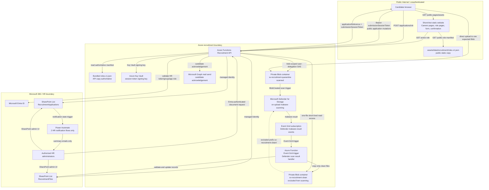

# ShoreVest Phase 1 Recruitment Build Specification

Status: authoritative PR 1 build specification. This document is specification-only for the Phase 1 recruitment implementation. It must not be interpreted as enabling public application submission.

## Scope discipline

Phase 1 uses the existing ShoreVest static website for public careers content, role listings, role detail pages, application form, and submission confirmation. Sensitive recruitment operations belong in Azure Functions. Candidate personal information, application records, CVs, cover letters, supporting documents, secrets, tenant IDs, storage keys, and credentials must not be stored in this static website repository.

Do not introduce Dataverse, a custom enterprise ATS, SharePoint document storage, public SharePoint upload links, email-based application tracking, direct CV attachments, speculative workflow engines, additional microservices, or a reviewer dashboard in Phase 1.

## Role manifest contract

The single authoritative role manifest contract is:

- manifest: `assets/data/recruitment/roles.v1.json`;
- schema: `assets/data/recruitment/roles.v1.schema.json`.

The same manifest must be bundled into both the public static-site deployment and the future Azure Functions deployment. The public copy may render role listings and role detail links. The Azure Functions bundled copy is authoritative for deciding whether applications are accepted. Adding a role to the manifest does not by itself enable application submission, and production application submission remains disabled until the backend, private storage, malware quarantine, authorization, monitoring, and required HR/legal/IT decisions are complete.

The manifest must support English and Simplified Chinese locale records for every role. Do not publish fictional roles. Until real role copy is explicitly approved, `roles` remains empty.

## Component architecture



## Public application session security

`ApplicationId`, `FileId`, email address, and idempotency key are not authorization credentials.

`POST /applications/init` must issue:

- `applicationId`: non-public internal API identifier;
- `applicationReference`: non-sensitive human-readable reference, for example `APP-2026-7F3K9Q`;
- `submissionSessionToken`: signed opaque expiring token;
- `submissionSessionExpiresAtUtc`.

Every subsequent public mutation for that application must include:

```http
Authorization: Bearer <submissionSessionToken>
```

Required token-protected public mutations include file authorization, upload completion, final submission, and any future replacement or cancellation operation. The token must be scoped to one `ApplicationId`, scoped to permitted operations, signed using a Key Vault-managed secret or asymmetric key, short-lived, revocable, and rejected if expired, tampered with, revoked, or used for another application. Do not expose SharePoint item IDs.

## Public API contract summary

- `GET /roles/{roleId}`: public role lookup from the API-bundled manifest. Removes the redundant `POST /roles/validate` endpoint.
- `POST /applications/init`: public initialization; creates the application record and returns `applicationReference` plus `submissionSessionToken`.
- `POST /applications/{applicationId}/files/authorize`: requires submission-session bearer token; validates declared file metadata; issues one blob-scoped user-delegation SAS.
- `POST /applications/{applicationId}/files/{fileId}/complete`: requires submission-session bearer token; verifies Blob existence, byte length, type, signature, ETag, and transactional checksum result where available.
- `POST /applications/{applicationId}/finalize`: requires submission-session bearer token; requires privacy consent, accuracy confirmation, verified required files, and sends an idempotent branded candidate acknowledgement.
- HR document access endpoints are Entra-protected and generate short-lived access to one clean Blob only.
- Defender scan processing is not an HTTP endpoint; it is an Event Grid-triggered Function.

## Required and optional application fields

Required fields:

- full legal or professional name;
- email;
- telephone;
- current city and country;
- role ID, automatically populated;
- availability or notice period;
- short application statement;
- CV;
- privacy consent;
- confirmation that submitted information is accurate.

Optional fields:

- preferred name;
- LinkedIn URL;
- current employer;
- current position;
- referral source;
- referring employee;
- cover letter;
- supporting document;
- role-specific screening questions;
- language capability.

Work-authorization questions are role- and jurisdiction-configurable and must not be universally required. Do not collect date of birth, photograph, gender, marital status, identification numbers, or salary history.

## Status models

### SubmissionStatus

API-controlled technical ingestion status. Exact values:

- `Draft`
- `UploadPending`
- `ScanPending`
- `ReadyForReview`
- `DocumentIssue`
- `Expired`
- `Deleted`

`SubmissionStatus` tracks technical readiness only. It must not encode HR outcomes.

### HiringStage

HR-controlled recruitment stage after the application becomes reviewable. Exact values:

- `New`
- `HRReview`
- `Interview`
- `Rejected`
- `Hired`
- `Withdrawn`
- `Archived`

Retention category, legal hold, expiry, and deletion controls remain separate from both status fields.

### FileStatus

Exact values:

- `Expected`
- `UploadAuthorized`
- `Uploaded`
- `PendingScan`
- `Clean`
- `Promoted`
- `Malicious`
- `ScanFailed`
- `ScanTimedOut`
- `RejectedOversized`
- `RejectedInvalidType`
- `Expired`
- `Deleted`

HR may access a file only when `FileStatus` is `Promoted`, and only through server-authorized one-file clean-document access.

## Blob storage, SAS, file types, and integrity

Use Azure Blob Storage as the only document store:

- quarantine container: `sv-recruitment-quarantine`;
- clean container: `sv-recruitment-clean`.

Only the quarantine container is scanned. Defender for Storage on-upload malware-scanning filters must exclude the entire clean container using the prefix `sv-recruitment-clean/` because clean-file promotion creates additional Blob events.

Use blob-scoped user-delegation SAS. Prefer `Create` permission only where technically sufficient so the expected Blob cannot be overwritten. Never issue broad container write SAS. Never permit read, list, or delete in upload SAS permissions.

SAS is not a reliable maximum-upload-size control. Enforce file size through server-side declared-size validation before SAS issuance, exact Blob-size verification after upload, rejection and deletion of oversized Blobs, and blocking finalization until verification succeeds.

Requested configurable file formats are PDF, DOC, and DOCX. Require extension, MIME, and signature validation for every uploaded file, and continue to quarantine and malware-scan every file. If IT later declines DOC or DOCX, record that as an unresolved decision rather than silently narrowing support.

Phase 1 integrity rule: require a transactional upload checksum supported by Azure Blob upload where available, store Blob ETag and verified byte length, treat client-provided SHA-256 only as supplementary and untrusted, and do not require Azure Functions to download every file to compute SHA-256 unless IT approves that design.

Original filenames must not appear in Blob paths, Blob metadata, public URLs, notification subjects, or SharePoint Title fields.

## Event Grid-triggered Defender processing

Implement scan-result processing as an Azure Event Grid-triggered Function. Document and validate:

- Event Grid subscription;
- expected Defender malware-result event type;
- expected topic/source;
- expected storage account;
- expected quarantine container;
- exact expected Blob path;
- event-ID idempotency;
- handling of `No threats found`, `Malicious`, `Error`, `Not scanned`, and `Scan timed out`;
- replay and out-of-order event handling.

A `No threats found` result may promote/copy the file into the clean container after validation. `Malicious`, `Error`, `Not scanned`, and `Scan timed out` results must never expose the file to HR reviewers.

## SharePoint system of record

Create exactly two Phase 1 SharePoint Lists:

- `RecruitmentApplications`
- `RecruitmentFiles`

Do not replace `RecruitmentFiles` with JSON on the application record. Do not create additional lists for speculative use. SharePoint is the HR administration interface, not document storage.

### Reduced indexes

`RecruitmentApplications` should normally index only:

- `ApplicationId`
- `ApplicationReference`
- `SubmissionStatus`
- `HiringStage`
- `RoleId`
- `CandidateEmail`
- `SubmittedAtUtc`
- `RetentionDeleteAfterUtc`
- `LegalHold`

`RecruitmentFiles` should normally index only:

- `FileId`
- `ApplicationId`
- `FileStatus`
- `ScanEventId`
- `RetentionDeleteAfterUtc`
- `LegalHold`

Do not exceed SharePoint index limits. Set SharePoint `Title` for applications to the non-PII `ApplicationReference`. Set file `Title` to a non-PII file reference, not the original filename.

## Authorization and RBAC

SharePoint filtered views are not access control. Client-side route protection is not authorization. Azure Functions is authoritative for public session validation, HR authorization, upload authorization, upload completion, malware outcome handling, and clean-document access.

Azure Functions managed identity must use:

- `Storage Blob Delegator` at storage-account scope to request user-delegation keys;
- minimum required Blob data permissions scoped to `sv-recruitment-quarantine`;
- minimum required Blob data permissions scoped to `sv-recruitment-clean`;
- no storage account keys in code or configuration;
- Shared Key access disabled where the final environment supports it;
- least-privilege Graph/SharePoint permissions for exactly two lists and candidate acknowledgement mail send;
- Key Vault permission only for the submission-session signing key or required secret material.

## Notifications

Power Automate is limited to two HR notification flows:

1. New application received.
2. Documents clean and ready.

Each notification must use atomic notification state:

- `NotificationState`: `Pending`, `Sending`, `Sent`, `Failed`;
- `NotificationEventKey`;
- `NotificationSentAtUtc`;
- `NotificationAttemptCount`;
- `NotificationLastErrorCode`.

Power Automate trigger concurrency control must be enabled. The flow must claim `Pending` to `Sending` before sending. Only one flow execution may successfully claim a given event key. Emails must contain summary information and secure internal links only. Emails must not contain CV attachments, document attachments, public file links, or reusable SAS links.

Candidate acknowledgement is separate from Power Automate. After successful finalization, Azure Functions sends an idempotent branded acknowledgement email through Microsoft Graph from the approved ShoreVest recruitment mailbox. The email must contain candidate name, role, application reference, submission time, concise next-step wording, privacy wording, and a warning that ShoreVest never asks candidates to make payments. It must not contain document links or internal information.

## Administrator setup summary

Mandatory setup before production application submission:

1. Approve privacy notice, consent wording, file-type allowlist, max file size/count, and retention decisions.
2. Create Azure storage account with public Blob access disabled.
3. Disable Shared Key access where supported.
4. Create private quarantine and clean containers.
5. Enable Defender for Storage on-upload malware scanning.
6. Configure Defender filters to exclude `sv-recruitment-clean/` and scan only quarantine uploads.
7. Create Event Grid subscription to the Event Grid-triggered scan handler.
8. Create Azure Functions app with managed identity.
9. Assign `Storage Blob Delegator` at storage-account scope and minimum Blob data permissions at container scopes.
10. Create Key Vault and grant only required signing-key permissions.
11. Configure Entra authentication and HR group/app role authorization.
12. Configure Microsoft Graph mail permission for candidate acknowledgements.
13. Create exactly two SharePoint lists and the reduced indexes.
14. Configure HR-only SharePoint list permissions.
15. Configure the two Power Automate flows with concurrency control.
16. Configure exact CORS origins, monitoring, alerts, lifecycle policies, and production access review.

## PR implementation sequence

PR 1 establishes this build specification and role manifest contract only. Later PRs must be staged separately:

1. Specification and role manifest contract.
2. Frontend role rendering only, no application submission.
3. Azure Functions role lookup and session-token initialization.
4. SharePoint schema and application creation.
5. Upload authorization with submission-session enforcement.
6. Upload completion verification.
7. Event Grid-triggered Defender scan handler.
8. HR authorization and clean-document access.
9. Candidate acknowledgement email.
10. Power Automate HR notifications.
11. Frontend application form integration, disabled by default.
12. Production enablement.

No public application submission may be enabled until the backend, private storage, malware quarantine, authorization, monitoring, and required business approvals are complete.

## Acceptance tests for PR 1

PR 1 must verify:

- `roles.v1.json` validates against `roles.v1.schema.json`;
- role IDs are unique;
- every role has both English and Chinese locale data;
- public roles have detail-page paths;
- only supported extensions, MIME types, and file-signature identifiers are used;
- no real secrets, credentials, tenant IDs, mailbox addresses, candidate PII, or candidate data are present in the manifest;
- the roles array is empty unless approved role copy already exists;
- visible website behavior is unchanged;
- application submission remains disabled.

## Unresolved business decisions

| Decision | Owner | Technical dependency | Blocks production | Safe temporary default |
| --- | --- | --- | --- | --- |
| Rejected-candidate retention period | HR + Legal | Retention fields/job | Yes | None |
| Withdrawn-candidate retention period | HR + Legal | Retention fields/job | Yes | None |
| Incomplete-submission cleanup period | HR + Legal + IT | Draft/upload expiry | Yes | Monitor only; no deletion |
| Malicious-file treatment and retention | Security + Legal + HR | Malware incident process | Yes | Quarantine; never expose; no deletion until approved |
| Legal-hold process | Legal + HR | LegalHold/deletion skip | Yes | Field exists; destructive deletion disabled |
| Privacy notice wording | Legal | Form and acknowledgement | Yes | None |
| Consent wording/versioning | Legal + HR | Consent fields | Yes | None |
| Cross-border data handling | Legal + IT | Azure/SharePoint regions and notices | Yes | None |
| PDF/DOC/DOCX approval | IT + Security + HR | Manifest allowlist/signature validation | Yes | Keep requested set in non-production; record any decline |
| Maximum file size | IT + HR | Manifest/upload validation | Yes | Non-production placeholder only |
| Maximum file count | HR + IT | Manifest/file slots | Yes | Non-production placeholder only |
| Candidate acknowledgement wording/sender | HR + Legal + IT | Graph send/mailbox permission | Yes | None unless explicitly deferred |
| Candidate status links required | HR | Separate tokenized status design | No if excluded | Exclude from Phase 1 |
| HR notification recipients and fallback owner | HR + IT | Power Automate | Yes | None |
| Non-HR reviewer access required | HR + IT + Security | Future Entra-protected review | No | Exclude from Phase 1 |
| Production support owner | IT + HR | Alerts/runbook | Yes | None |
| Security incident escalation owner | Security + IT + HR | Malicious-file process | Yes | None |

## Implementation readiness

The role manifest contract and specification can be reviewed immediately. Actual application submission requires administrator action and the unresolved HR, legal, and IT decisions above. Production application submission remains disabled.
